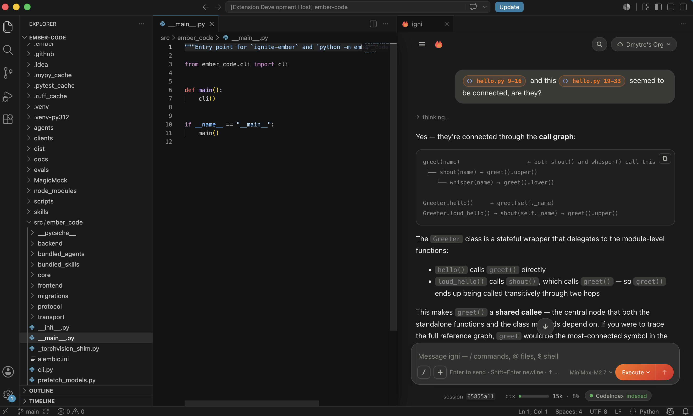
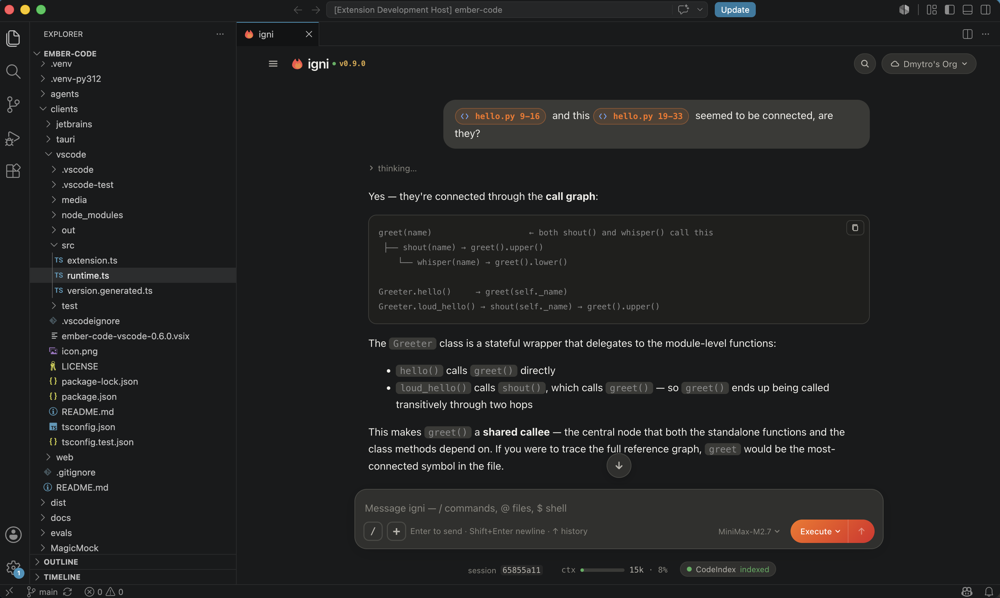

# igni — AI coding assistant for VS Code

Chat with your codebase from a panel next to your editor. Multi-agent
orchestration, plan-then-act mode, full tool access — with an approval
dialogue on every tool call so nothing runs without you saying yes.

## What you can do

- **Chat with your project.** `@`-mention files to attach them; drop
  slash commands to drive structured actions; ask for cross-file
  refactors in natural language and watch the diffs stream in.
- **Plan mode.** The agent researches your code and proposes a plan
  before touching anything. Approve as-is or refine. Backed by a
  confidence check so the plan is grounded in what it actually read.
- **Multi-agent orchestration.** Spawn parallel sub-agents so a large
  task decomposes into concurrent research + implementation + review,
  each streaming progress into the same conversation.
- **Session per project.** Chat history persists per repository. Fork
  a session with `/fork` to explore an alternative approach without
  losing the original thread.
- **Cross-window sync.** Open the extension in VS Code and the
  JetBrains plugin on the same repo; both talk to the same backend
  for the project, so what you type in one appears live in the
  other.
- **Model-agnostic.** Claude, OpenAI, Gemini, Groq, MiniMax, and any
  model reachable via API. Switch mid-session with `/model`.
- **Follows your VS Code theme.** The chat panel background sources
  its colour from `--vscode-sideBar-background`, so it reads as
  native VS Code chrome across any installed colour theme.

## Install

Install the extension from the Marketplace. On first launch it
downloads `uv` and provisions Python + `ignite-ember` into a
per-user cache — no manual `pip install`, no interpreter to
configure. From there, network use is whatever your configured
model provider needs — Anthropic, OpenAI, etc.

Open the chat with `⇧⌘P` → **igni: Open Chat** (or `Ctrl+Shift+P`
on Windows/Linux).

## Slash commands

The composer accepts a rich set of slash commands for driving the
session without touching a menu:

| Command | What it does |
|---|---|
| `/plan` | Enter plan mode — agent researches before acting |
| `/fork` | Clone the current session into a new branch |
| `/sessions` | List and switch between sessions in this project |
| `/model` | Switch the model powering the current session |
| `/mcp` | Manage Model Context Protocol server connections |
| `/agents` | List installed agents (built-in + plugin + project-local) |
| `/skills` | List installed skills |
| `/plugins` | Manage installed plugins from the marketplace |
| `/knowledge` | Chunk, embed, and query project documentation |
| `/codeindex` | Manage the semantic code index |
| `/hooks` | Configure PreToolUse / PostToolUse hooks |
| `/loop` | Schedule a recurring self-paced task |
| `/schedule` | Schedule a one-shot or cron task |
| `/memory` | Read + write persistent memories across sessions |
| `/clear` | Wipe the current session (fork if you want to keep it) |
| `/compact` | Compress old messages to free context |

## Configuration

Two settings live under **Settings → Extensions → igni**:

- `emberCode.pythonPath` — path to a Python interpreter with
  `ignite-ember` already installed. Set this to bypass the managed
  bootstrap (useful during local development on the backend
  itself).
- Standard proxy honoring — `http.proxy` and `http.proxyStrictSSL`
  from your VS Code settings propagate to the backend for the
  first-launch download.

## Links

- **Homepage** — https://ignite-ember.sh
- **Repository** — https://github.com/ignite-ember/igni
- **Issue tracker** — https://github.com/ignite-ember/igni/issues
